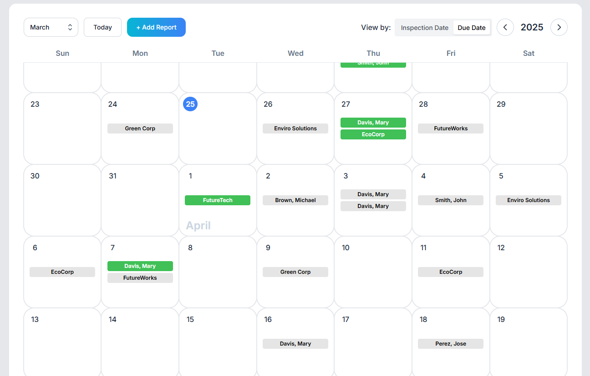

# Report Tracker

[Front-end repository](https://github.com/allen11yu/report-tracker-frontend) | [Back-end repository](https://github.com/allen11yu/report-tracker-backend)

A calendar-based platform designed to streamline report tracking. Built with React for the front end, Spring Boot for the back end, PostgreSQL for the database, and deployed on AWS, the app offers a user-friendly interface to manage and monitor report progress.

